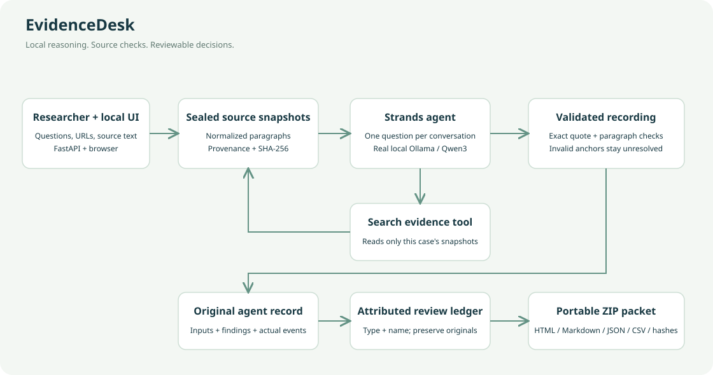

# EvidenceDesk

Planned public repository: **https://github.com/ZackaryLoevseth/evidencedesk-strands**. This source tree was staged before publication; the URL is not yet a claim that the repository exists.

**Turn a research brief into a packet someone else can actually review.**

EvidenceDesk is a local professional research workflow built with the **Strands Agents SDK**. A researcher supplies questions and public-source excerpts. A real local language model searches those snapshots, proposes answers, and records quotation anchors through Strands tools. Deterministic checks verify each quotation against the specified paragraph. Review annotations explicitly identify a human or automated reviewer before the user exports a packet containing the original agent output, source snapshots, review history, coverage CSV, and file hashes.

The audience is a research or engineering team preparing a technology assessment. The repetitive work is tracing an answer back to its evidence, accounting for unanswered questions, and preserving review decisions for a colleague. EvidenceDesk completes that handoff instead of leaving the researcher with a chat transcript.



## What is different

- **Two separate decisions:** an exact quotation check does not validate the model's interpretation. Both remain visible.
- **Every question survives:** missing or malformed agent findings become unresolved rows; nothing disappears from the brief.
- **A bounded real agent:** Strands runs a separate conversation for each question, with source-search and validated-record tools, one retry for an unrecorded answer, and a five-model-call limit. A valid JSON answer returned as prose is explicitly labeled as application-validated model output, never as a model-issued tool call.
- **Originals stay original:** case inputs and agent findings are sealed with SHA-256. Attributed reviewer decisions are appended separately and cannot silently rewrite a model result.
- **A portable handoff:** ZIP export includes readable Markdown/HTML, original JSON, a review ledger, coverage CSV, source text, and `SHA256SUMS`.

## Run the working application

Requires Python 3.12+, a desktop computer, and [Ollama](https://ollama.com/download). The tested local model is `qwen3:1.7b` (approximately 1.4 GB download; Apache 2.0 model license). No inference API key, paid model service, AWS credentials, Docker, Node build step, or hosted database is needed for this local build.

After the repository is published (or extract the source release ZIP), enter the source directory:

```sh
git clone https://github.com/ZackaryLoevseth/evidencedesk-strands.git
cd evidencedesk-strands
```

```sh
python3 -m venv .venv
source .venv/bin/activate
python -m pip install -r requirements-lock.txt
python -m pip install --no-deps -e .
```

Start Ollama in another terminal if its application is not already running, download the model, and start EvidenceDesk:

```sh
ollama serve
```

```sh
ollama pull qwen3:1.7b
evidencedesk serve --port 8765
```

Open **http://127.0.0.1:8765**. Click **Load real-source example**, then **Create brief & analyze**. The example asks three real technology-adoption questions using short excerpts captured from official Strands documentation on September 7, 2026. It is not a canned model transcript. Clicking Analyze invokes the model.

The UI requires a reachable Ollama server. If the model is missing it says so, preserves the newly created brief, and offers a run button. It never substitutes simulated AI output. The public documentation importer requires internet access; an already captured source pack and local model run without external inference. Import only sources you are entitled to use.

For a reproducible CLI run:

```sh
evidencedesk run src/evidencedesk/fixtures/source_pack.json --output demo-output
```

The CLI writes `case.json` and `review-packet.zip`. The web app stores cases in `.data/cases`. One web-app run executes at a time. Do not run the CLI concurrently with the app's inference on a memory-constrained machine. The configured context is 4,096 tokens with four CPU threads; the model unloads after each request. Larger models can be selected with `EVIDENCEDESK_MODEL`, but they have not been validated here.

Optional configuration:

```sh
export EVIDENCEDESK_OLLAMA_HOST=http://127.0.0.1:11434
export EVIDENCEDESK_MODEL=qwen3:1.7b
export EVIDENCEDESK_DATA=.data/cases
```

This edition restricts its model provider to loopback Ollama. No implicit Bedrock fallback or paid provider is configured. Contest account and AWS Builder ID requirements are separate from this application's runtime.

## Use the workflow

1. Name the brief and enter up to eight focused research questions.
2. Paste source excerpts with their original HTTPS publication URLs, or capture documentation from the supported official sites. Import keeps readable paragraphs and omits layout, code blocks, and tables; inspect original context when relevant. The UI reports truncation at the 30,000-character limit.
3. Run the agent. Its actual search/record tool events appear in the activity panel.
4. Inspect each quotation in its full snapshot paragraph. Explicitly choose Human or Automated, identify the reviewer, and record an acceptance, inference, rejection, or pending decision with a note. No reviewer type is selected by default. Automated review is not represented as human approval.
5. Export the packet. `agent-run.json` preserves model findings. `review-ledger.json` contains the subsequent attributed notes. `review-packet.html` can be opened or printed locally without scripts or external assets.

Public HTML capture is intentionally limited to Strands, Ollama, Python and AWS documentation. Other source material can be pasted. The model has no URL-fetch, shell, filesystem, deployment, or messaging tool; it only reads the snapshots in its case and records findings. Source prose is treated as data, not authority to change the workflow.

## Validation and honest limits

```sh
python -m pytest -q
```

The automated suite checks exact-match failures, wrong paragraph locators, snapshot/index changes, preservation of every question, separate review history, original-run sealing, ZIP hashes, CSV formula neutralization, HTML escaping, importer origin restrictions, interrupted-run recovery, API lifecycle, and explicit model-unavailable behavior. Tests use clearly labeled synthetic fixtures; the actual demo uses captured primary documentation and a real model.

`validation/` contains actual model-run evidence and a validation report. Early runs are retained when a failure informed a correction; see the report before choosing a demonstration run. No model output is a proof of source interpretation. A small model can choose weak evidence or miss relevant text. Lexical retrieval searches only the supplied excerpts and returns at most three passages, each capped at 1,800 characters; it is not a comprehensive literature search. A quotation hash proves snapshot integrity, not the publisher's identity, truth, or freshness. Source paragraph numbers are local snapshot identifiers, not original publication line numbers. Local machine owners can edit files and recompute hashes; the seals are consistency checks, not digital signatures.

The application is for one trusted local user. It binds to loopback, has no accounts, and has not been prepared for public multi-user deployment. Case data remains in local files; the operator is responsible for choosing appropriate source material. This tool makes no legal conclusions, eligibility determinations, or professional-performance guarantees.

## Project and submission provenance

New application created September 7, 2026 for the **AWS Agents for Humans — Professional Agents** track. No previous project implementation was imported. Standard libraries and SDKs are listed in the lock file. Development used OpenAI Codex for implementation, review, tests, and documentation; this is disclosed in [AI assistance](docs/AI_ASSISTANCE.md). Real inference uses the separately downloaded Qwen model through Ollama, not Codex's response as an application result.

Original project code is MIT licensed. Dependencies retain their own licenses; see [third-party notices](THIRD_PARTY_NOTICES.md). The source example consists of attributed excerpts, not a relicensed copy of the third-party documentation. A demo narrative and draft submission description are in `docs/`. Publication, registration, and the required public video are separate submission steps; this repository itself does not claim an accepted submission or award.
